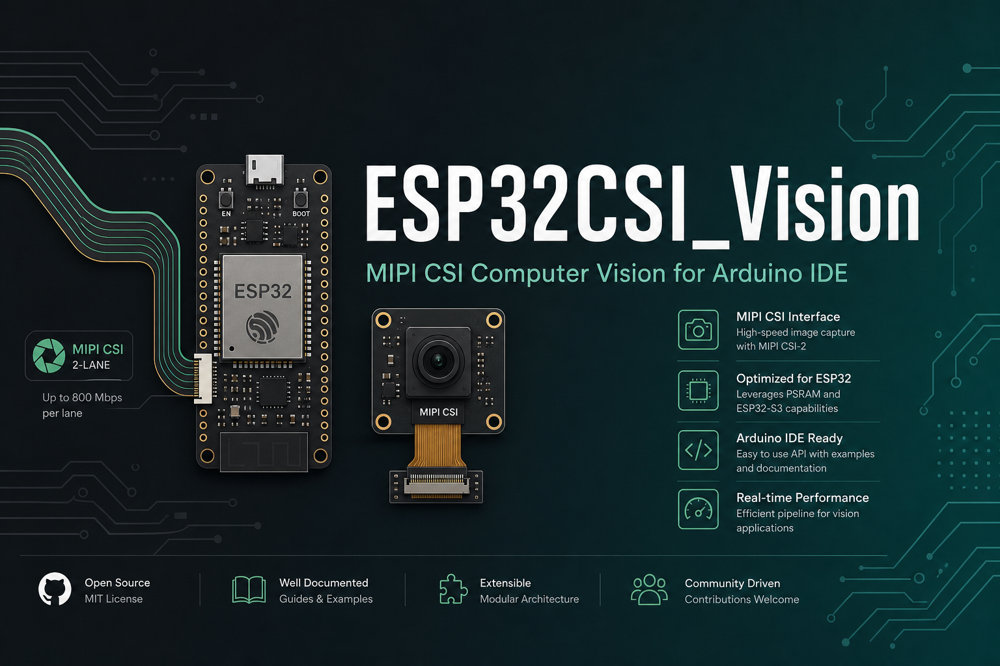
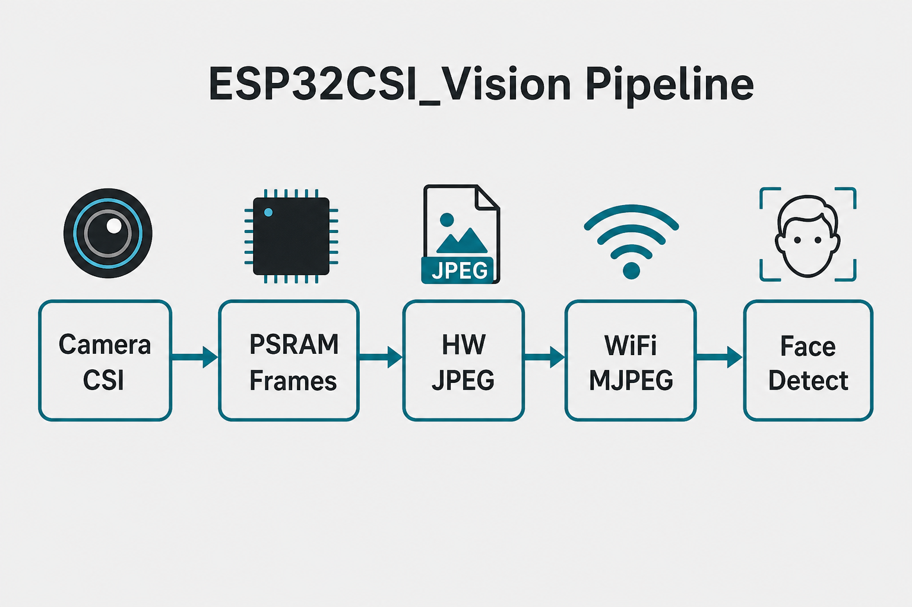
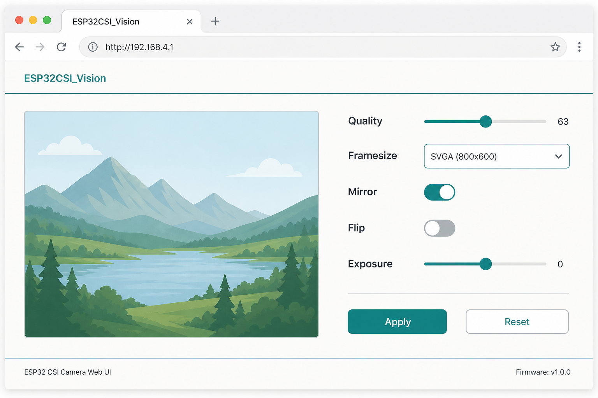

<p align="center">
  
</p>

# ESP32CSI_Vision

**Arduino IDE–ready MIPI CSI computer vision for ESP32**

Capture frames from CSI cameras, encode JPEG in hardware, stream a live webcam UI over Wi‑Fi, run motion DSP, and (with ESP-IDF) detect faces with ESP-DL.

Named for **CSI + vision** — not locked to one chip. **ESP32-P4 today**; other CSI-capable Espressif SoCs later.

[](LICENSE)
[](https://www.arduino.cc/en/software)
[](https://github.com/espressif/arduino-esp32)
[](https://www.espressif.com/)
[](https://github.com/thezerohz/ESP32CSI_Vision)

**Author:** [Rakib Hasan](https://github.com/thezerohz) ([@thezerohz](https://github.com/thezerohz))

---

## Table of contents

- [Why this library](#why-this-library)
- [What you get](#what-you-get)
- [Pipeline](#pipeline)
- [Requirements](#requirements)
- [Install (Arduino IDE)](#install-arduino-ide)
- [Quick start (5 minutes)](#quick-start-5-minutes)
- [Wi‑Fi MJPEG webcam](#wi-fi-mjpeg-webcam)
- [HTTP API](#http-api)
- [Board presets](#board-presets)
- [API reference](#api-reference)
- [Examples](#examples)
- [ESP-IDF face detect](#esp-idf-face-detect)
- [Arduino IDE board settings](#arduino-ide-board-settings)
- [Troubleshooting](#troubleshooting)
- [Compatibility headers](#compatibility-headers)
- [License](#license)

---

## Why this library

| Pain | What ESP32CSI_Vision does |
| --- | --- |
| CSI on ESP32 is hard to wire up in Arduino | One `#include`, board preset, `cam.begin()` |
| Streaming blocks settings UI | Dual ports: UI on **:80**, MJPEG on **:81** |
| Names like `ESP32P4_*` lock the brand to one SoC | Library is **CSI_Vision** — backend is P4 today |
| Face models need ESP-DL | Clear split: Arduino for capture/stream; IDF example for faces |

---

## What you get

| Feature | Arduino IDE | ESP-IDF |
| --- | :---: | :---: |
| OV5647 / IMX708 MIPI CSI → RGB565 | Yes | Yes |
| PSRAM multi-framebuffer capture | Yes | Yes |
| Hardware JPEG encode / decode | Yes | Yes |
| PPA scale / rotate / mirror | Yes | Yes |
| Motion DSP | Yes | Yes |
| Wi‑Fi MJPEG + live settings UI | Yes | Yes |
| WHO-style async frame pipeline | Yes | Yes |
| ESP-DL human face detect | — | Yes (`idf_examples/08_FaceDetect`) |

---

## Pipeline

<p align="center">
  
</p>

```text
Sensor (OV5647 / IMX708)
        │  MIPI CSI + ISP
        ▼
   RGB565 frames in PSRAM  (multi-FB)
        │
   ┌────┼────────────────┐
   ▼    ▼                ▼
 JPEG  PPA scale      Motion DSP
   │
   ▼
 Wi‑Fi MJPEG UI  (:80 settings / :81 stream)
   │
   └─► ESP-DL face detect  (ESP-IDF only)
```

---

## Requirements

### Hardware (current backend)

- **SoC:** ESP32-P4 with MIPI CSI
- **PSRAM:** enabled (required for multi-FB + JPEG)
- **Camera:** OV5647 or IMX708 (I²C probe / auto)
- **Tested board:** Guition JC-ESP32P4-M3 (also presets for Waveshare Nano, Function EV)
- **Wi‑Fi (Guition M3):** ESP-Hosted C6 over SDIO

### Software

| Tool | Version |
| --- | --- |
| [Arduino IDE](https://www.arduino.cc/en/software) | 2.x recommended |
| [arduino-esp32](https://github.com/espressif/arduino-esp32) | **3.3.x** |
| ESP-IDF (face example only) | **5.4 / 5.5** |

---

## Install (Arduino IDE)

### Option A — ZIP / GitHub

1. Download or clone:  
   `https://github.com/thezerohz/ESP32CSI_Vision`
2. In Arduino IDE: **Sketch → Include Library → Add .ZIP Library…**  
   or copy the folder to:

```text
Documents/Arduino/libraries/ESP32CSI_Vision
```

3. Restart Arduino IDE. Confirm under **Sketch → Include Library → ESP32CSI_Vision**.

### Option B — PlatformIO

```ini
lib_deps = https://github.com/thezerohz/ESP32CSI_Vision.git
```

### Verify install

```cpp
#include <ESP32CSI_Vision.h>
```

If compile fails with “No such file”, the library folder name/path is wrong (must contain `library.properties` and `src/ESP32CSI_Vision.h`).

---

## Quick start (5 minutes)

Minimal capture loop — open **File → Examples → ESP32CSI_Vision → 01_CamTest**.

```cpp
#include <ESP32CSI_Vision.h>

ESP32P4_Camera cam;

void setup() {
  Serial.begin(115200);
  delay(1200);

  // Board preset wires CSI / I2C / LDO for you
  if (!cam.begin(ESP32P4_BOARD_GUITION_M3)) {
    Serial.println("camera begin FAILED");
    while (true) delay(1000);
  }

  Serial.printf("sensor=%s %ux%u\n",
                cam.sensorName(), cam.width(), cam.height());
}

void loop() {
  camera_fb_t *fb = cam.capture(2000);  // timeout ms
  if (!fb) {
    Serial.println("capture timeout");
    return;
  }

  // fb->buf  = RGB565 pixels in PSRAM
  // fb->len  = width * height * 2
  Serial.printf("frame %ux%u  %u bytes\n",
                fb->width, fb->height, (unsigned)fb->len);

  cam.release(fb);  // always release
}
```

### JPEG snapshot

```cpp
#include <ESP32CSI_Vision.h>

ESP32P4_Camera cam;
ESP32P4_Jpeg jpeg;
uint8_t *jpg;

void setup() {
  Serial.begin(115200);
  cam.begin(ESP32P4_BOARD_GUITION_M3);
  jpeg.begin(cam.width(), cam.height(), 45);           // quality 1–100
  jpg = (uint8_t *)esp32p4_psram_alloc(200 * 1024);
}

void loop() {
  camera_fb_t *fb = cam.capture();
  if (!fb || !jpg) return;

  size_t n = jpeg.encode(fb, jpg, 200 * 1024);
  cam.release(fb);

  Serial.printf("jpeg %u bytes\n", (unsigned)n);
  delay(500);
}
```

---

## Wi‑Fi MJPEG webcam

<p align="center">
  
</p>

Example: **04_WiFiMjpeg**

1. Edit Wi‑Fi SSID/password in the sketch.
2. On Guition M3, keep the C6 SDIO pin map (or set yours).
3. Upload with PSRAM enabled.
4. Open Serial Monitor @ **115200** → note the printed IP.
5. Browser:
   - **UI / settings:** `http://<ip>/`
   - **MJPEG stream:** `http://<ip>:81/stream`

```cpp
#include <WiFi.h>
#include <ESP32CSI_Vision.h>

ESP32P4_Camera cam;
ESP32P4_MjpegServer stream;

void setup() {
  Serial.begin(115200);
  cam.begin(ESP32P4_BOARD_GUITION_M3);

  // Guition M3 ESP-Hosted C6 SDIO (adjust for your board)
  WiFi.setPins(18, 19, 14, 15, 16, 17, 54);
  WiFi.mode(WIFI_STA);
  WiFi.setSleep(false);
  WiFi.begin("YOUR_SSID", "YOUR_PASS");
  while (WiFi.status() != WL_CONNECTED) delay(400);

  // port 80 = UI; stream auto-binds :81 so settings stay responsive
  stream.begin(&cam, 80, 35);  // quality ~35 = faster; 50–60 sharper

  Serial.printf("UI     http://%s/\n", WiFi.localIP().toString().c_str());
  Serial.printf("stream http://%s:%u/stream\n",
                WiFi.localIP().toString().c_str(), stream.streamPort());
}

void loop() {
  stream.loop();
}
```

### Desktop viewer

```bash
pip install -r examples/04_WiFiMjpeg/requirements.txt
python examples/04_WiFiMjpeg/cam_wifi_viewer.py 192.168.0.3 81
```

---

## HTTP API

| Endpoint | Port | Method | Role |
| --- | :---: | --- | --- |
| `/` | **80** | GET | Settings UI + live preview |
| `/control?var=…&val=…` | **80** | GET | Change a setting live |
| `/status` | **80** | GET | JSON status |
| `/jpg` or `/capture` | **80** | GET | Single JPEG snapshot |
| `/stream` | **81** | GET | Multipart MJPEG (may block that port only) |

### Common `/control` variables

| `var` | Example `val` | Effect |
| --- | --- | --- |
| `quality` | `1`–`100` | JPEG quality |
| `framesize` | `0`–`4` | Stream size via PPA (SVGA→QQVGA) |
| `frameskip` | `0`+ | Skip N frames between encodes |
| `hmirror` / `vflip` | `0`/`1` | Mirror / flip |
| `aec` / `agc` | `0`/`1` | Auto exposure / gain |
| `exposure` / `gain` | sensor units | Manual exposure / gain |
| `gainceiling` | sensor units | Gain ceiling |
| `pattern` | `0`/`1` | Sensor test pattern |

**Stream framesize enum**

| Value | Name | Size |
| :---: | --- | --- |
| 0 | `ESP32P4_STREAM_SVGA` | 800×640 (native) |
| 1 | `ESP32P4_STREAM_VGA` | 640×480 |
| 2 | `ESP32P4_STREAM_HVGA` | 480×320 |
| 3 | `ESP32P4_STREAM_QVGA` | 320×240 |
| 4 | `ESP32P4_STREAM_QQVGA` | 160×120 |

---

## Board presets

```cpp
cam.begin(ESP32P4_BOARD_GUITION_M3);      // Guition JC-ESP32P4-M3 (default)
cam.begin(ESP32P4_BOARD_WAVESHARE_NANO);
cam.begin(ESP32P4_BOARD_FUNCTION_EV);
```

Custom pins / sensor:

```cpp
esp32p4_cam_config_t cfg = esp32p4_cam_config_default();
cfg.sda = 7;
cfg.scl = 8;
cfg.sensor = ESP32P4_SENSOR_OV5647;   // or IMX708 / AUTO
cfg.fb_count = 3;                     // PSRAM framebuffers
cfg.frame_size = ESP32P4_FRAMESIZE_800X640;
if (!cam.begin(cfg)) { /* fail */ }
```

| Sensor | Typical I²C | Notes |
| --- | --- | --- |
| OV5647 | `0x36` | Common Raspberry Pi–style CSI module |
| IMX708 | probed | Supported driver in tree |

---

## API reference

### `ESP32P4_Camera`

| Method | Description |
| --- | --- |
| `begin(board)` / `begin(cfg)` | Init CSI + ISP + PSRAM FBs |
| `end()` | Tear down |
| `capture(timeout_ms)` | Wait for a frame; returns `camera_fb_t*` or `nullptr` |
| `release(fb)` | Return framebuffer to the pool |
| `width()` / `height()` | Active resolution |
| `sensorName()` / `detected()` | Sensor info |
| `setHMirror` / `setVFlip` | Geometry |
| `setAEC` / `setAGC` / `setExposure` / `setGain` / `setGainCeiling` | Exposure path (OV5647) |
| `setTestPattern(bool)` | Color bars / pattern |
| Matching `get*()` helpers | Read back settings |

**`camera_fb_t`**

| Field | Meaning |
| --- | --- |
| `buf` | Pixel buffer (RGB565) |
| `len` | Byte length |
| `width` / `height` | Pixels |
| `format` | `ESP32P4_PIXFORMAT_RGB565` (typical) |
| `timestamp_us` | Capture time |

### `ESP32P4_Jpeg`

| Method | Description |
| --- | --- |
| `begin(max_w, max_h, quality)` | Init HW JPEG |
| `encode(fb, out, out_cap)` | RGB565 → JPEG bytes |
| `decode(jpg, len, rgb_out, …)` | JPEG → RGB |
| `setQuality(q)` | 1–100 |

### `ESP32P4_MjpegServer`

| Method | Description |
| --- | --- |
| `begin(cam, port, quality)` | Start UI on `port`, stream on `port+1` |
| `loop()` | Keep HTTP tasks happy (call from `loop()`) |
| `setQuality` / `setFrameSkip` / `setFramesize` | Live stream knobs |
| `streamPort()` / `controlPort()` | Bound ports |
| `sent()` / `lastJpegBytes()` | Stats |

### Also included

| Header (via umbrella) | Role |
| --- | --- |
| `ESP32P4_Ppa` | Hardware scale / rotate / mirror |
| `ESP32P4_Dsp` | Motion detect on RGB565 |
| `ESP32P4_Who` | Async WHO-style frame pipeline |
| `esp32p4_psram_*` | PSRAM alloc helpers |

---

## Examples

| Example | What it teaches |
| --- | --- |
| `01_CamTest` | Capture + PSRAM health |
| `02_JpegSnapshot` | HW JPEG encode |
| `03_JpegDecode` | Round-trip decode |
| `04_WiFiMjpeg` | Full webcam UI + dual-port stream |
| `05_MotionDetect` | Frame-difference motion ROI |
| `06_PpaScale` | PPA resize |
| `07_WhoPipeline` | Async consumer pipeline |
| `idf_examples/08_FaceDetect` | ESP-DL faces (**ESP-IDF**, not Arduino IDE) |

Open Arduino examples via:

**File → Examples → ESP32CSI_Vision → …**

---

## ESP-IDF face detect

Arduino IDE **cannot** link ESP-DL / `human_face_detect` from the prebuilt Arduino-ESP32 SDK.

Use the IDF project:

```text
libraries/ESP32CSI_Vision/idf_examples/08_FaceDetect
```

```bat
idf.py -DSDKCONFIG_DEFAULTS=sdkconfig.defaults.esp32p4 set-target esp32p4
idf.py -p COMx build flash monitor
```

See `idf_examples/08_FaceDetect/README.md` for models (`MSRMNP_S8_V1`, ESPDet Pico, …).

---

## Arduino IDE board settings

Typical Guition JC-ESP32P4-M3:

| Setting | Value |
| --- | --- |
| Board | ESP32P4 Dev Module (or your vendor board) |
| **PSRAM** | **Enabled** |
| Flash Size | 16MB (if your board has 16MB) |
| USB Mode | Default / as required by your cable |
| CDC On Boot | Default / Enabled if using USB serial |
| Upload Speed | 921600 (or slower if flaky) |

FQBN-style example:

```text
esp32:esp32:esp32p4:PSRAM=enabled,FlashSize=16M,USBMode=default,CDCOnBoot=default
```

---

## Troubleshooting

| Symptom | Likely fix |
| --- | --- |
| `camera begin FAILED` | Wrong board preset / CSI flex not seated / sensor power (LDO) |
| `capture timeout` | Sensor not streaming; try test pattern; check I²C address in Serial |
| Compile: not ESP32-P4 | Select an ESP32-P4 board (current CSI backend) |
| Out of memory / JPEG fail | Enable **PSRAM**; reduce `fb_count` or stream framesize |
| Wi‑Fi never connects | Guition: set C6 SDIO pins; SoftAP fallback prints in Serial |
| Settings UI “network error” while watching stream | Use UI on **:80** and stream on **:81** (library default) |
| COM port busy on Windows | Close Serial Monitor / other apps using the port |
| Face detect won’t build in Arduino | Expected — use `idf_examples/08_FaceDetect` |

Enable verbose compile (**File → Preferences → Show verbose output**) if an include path looks wrong.

---

## Compatibility headers

Prefer the new umbrella header:

```cpp
#include <ESP32CSI_Vision.h>
```

Still work (shim / old sketches):

```cpp
#include <ESP32P4_Vision.h>
#include <ESP32P4_Cam.h>
#include <ESP32P4_CSI_Camera.h>
```

Class names such as `ESP32P4_Camera` remain for API stability while the **library brand** stays CSI-oriented.

---

## Project layout

```text
ESP32CSI_Vision/
├── src/
│   ├── ESP32CSI_Vision.h      ← include this
│   ├── cam/                   ← CSI capture
│   ├── jpeg/  ppa/  dsp/      ← encode / scale / motion
│   ├── stream/                ← MJPEG + UI
│   └── who/                   ← async pipeline
├── examples/                  ← Arduino IDE sketches
├── idf_src/                   ← face detect (IDF builds)
├── idf_examples/08_FaceDetect
├── docs/images/               ← README assets
├── library.properties
└── README.md
```

---

## Contributing / repo

- **Issues / PRs:** [github.com/thezerohz/ESP32CSI_Vision](https://github.com/thezerohz/ESP32CSI_Vision)
- **Changelog:** [CHANGELOG.md](CHANGELOG.md)

---

## License

MIT — Copyright (c) 2026 Rakib Hasan ([@thezerohz](https://github.com/thezerohz)).
